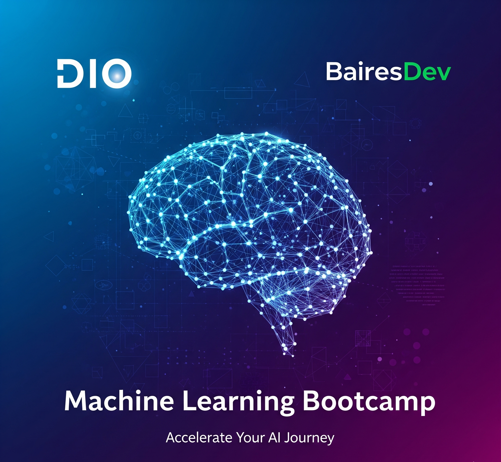

# Repositório de Atividades do Bootcamp

## Bem-vindo à Minha Jornada no Bootcamp

Este repositório contém todas as atividades e projetos desenvolvidos durante o **Bootcamp de Machine Learning** promovido pela **BairesDev** e **DIO (Digital Innovation One)**.

## Estrutura do Repositório

O repositório está organizado por atividades, com cada branch correspondendo a uma tarefa ou projeto específico do bootcamp. Esta branch principal contém informações gerais e documentação.

## Tecnologias e Ferramentas

Durante este bootcamp, trabalharemos com várias tecnologias relacionadas a Machine Learning, incluindo, entre outras:
- Python
- Scikit-learn
- Pandas
- NumPy
- Matplotlib
- Jupyter Notebooks

## Sobre o Bootcamp

Este programa intensivo abrange vários aspectos de Machine Learning, desde conceitos fundamentais até técnicas avançadas. O currículo inclui aprendizado supervisionado e não supervisionado, redes neurais, processamento de linguagem natural e muito mais.

## Navegação

Para acessar atividades específicas:
1. Verifique as branches disponíveis para tarefas específicas
2. Cada branch contém o código e a documentação para aquela atividade em particular

## Contato

Para mais informações sobre este repositório ou os projetos nele contidos, sinta-se à vontade para entrar em contato.