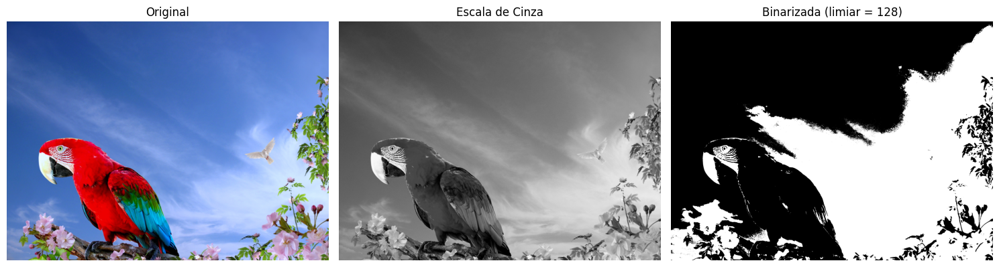

# Atividade de Redução de Dimensionalidade - Binarização de Imagem

Este projeto implementa uma técnica de binarização de imagem como parte das atividades do Bootcamp de Machine Learning pela BairesDev e DIO. O processo transforma uma imagem colorida em uma versão binarizada (preto e branco) com o objetivo de reduzir sua dimensionalidade e simplificar a representação visual.

## Processo

O projeto utiliza técnicas de redução de dimensionalidade para converter uma imagem colorida em uma versão binarizada. Este processo envolve:
- Carregamento da imagem original
- Conversão para escala de cinza
- Aplicação de algoritmo de binarização
- Visualização do resultado

## Resultado

A seguir é apresentado o resultado do processo de binarização:

## Como executar

1. Abra o notebook `reducao de dimensionalidade.ipynb`
2. Execute todas as células para ver o processo completo de binarização
3. O código carregará a imagem `imagem/parrot.jpg` e produzirá o resultado binarizado

## Dependências

- Python 3.x
- Jupyter Notebook
- OpenCV
- NumPy
- Matplotlib