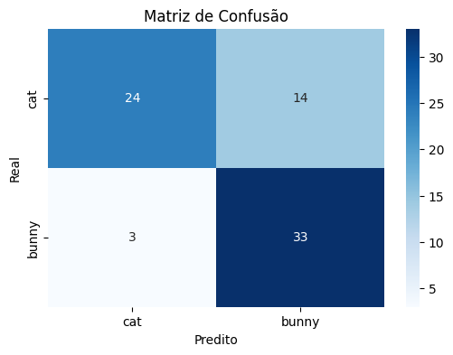
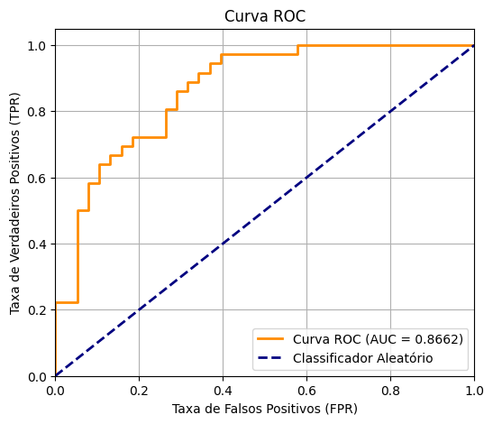
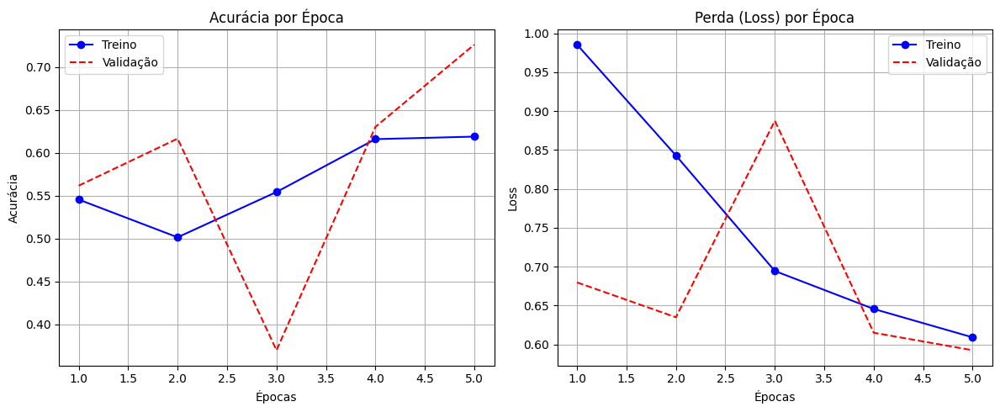

# Atividade 4 - Métricas de Avaliação para Transfer Learning

Esta atividade faz parte do bootcamp oferecido pela **BairesDev** em parceria com a **DIO (Digital Innovation One)**, e tem como objetivo apresentar as métricas de avaliação para o modelo de Transfer Learning desenvolvido na Atividade 2.

## Descrição

Nesta atividade, foram extraídas e analisadas as métricas de avaliação do modelo de classificação de imagens desenvolvido com Transfer Learning. O modelo foi treinado para distinguir entre duas classes: **gatos** e **coelhos**.

## Métricas de Classificação

Abaixo estão as métricas obtidas na avaliação do modelo:

```
Relatório de Classificação:

              precision    recall  f1-score   support

         cat       0.89      0.63      0.74        38
       bunny       0.70      0.92      0.80        36

    accuracy                           0.77        74
   macro avg       0.80      0.77      0.77        74
weighted avg       0.80      0.77      0.77        74
```

### Interpretação das Métricas

- **Precision (Precisão)**: Proporção de predições positivas que estavam corretas
  - Gatos: 89% das predições de gato estavam corretas
  - Coelhos: 70% das predições de coelho estavam corretas

- **Recall (Revocação/Sensibilidade)**: Proporção de instâncias positivas que foram detectadas corretamente
  - Gatos: 63% dos gatos reais foram identificados corretamente
  - Coelhos: 92% dos coelhos reais foram identificados corretamente

- **F1-Score**: Média harmônica entre precisão e revocação
  - Gatos: 0.74
  - Coelhos: 0.80

- **Accuracy (Acurácia)**: Proporção total de predições corretas: 77%

## Visualizações

A atividade incluiu diversas visualizações para análise do desempenho do modelo:

1. **Matriz de Confusão**: Mostra a distribuição das predições corretas e incorretas para cada classe
   

2. **Curva ROC**: Representa a relação entre taxa de verdadeiros positivos e taxa de falsos positivos
   

3. **Acurácia e Loss por Época**: Visualização da evolução da acurácia e perda durante o treinamento
   

4. **Histograma das Probabilidades de Predição**: Mostra a distribuição das probabilidades atribuídas a cada classe
5. **Visualização de Imagens com Previsão**: Exemplos reais com as predições do modelo

## Execução

O código completo pode ser acessado e executado no Google Colab através do link:

[colab.research.google.com/drive/1wtIKBNU97rTnFTMSTVS1HVuuMvyyPQQg?usp=sharing](https://colab.research.google.com/drive/1wtIKBNU97rTnFTMSTVS1HVuuMvyyPQQg?usp=sharing)
